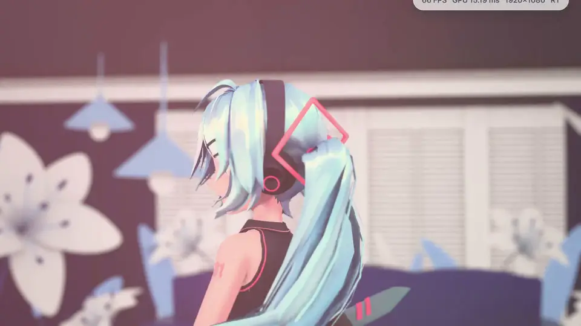
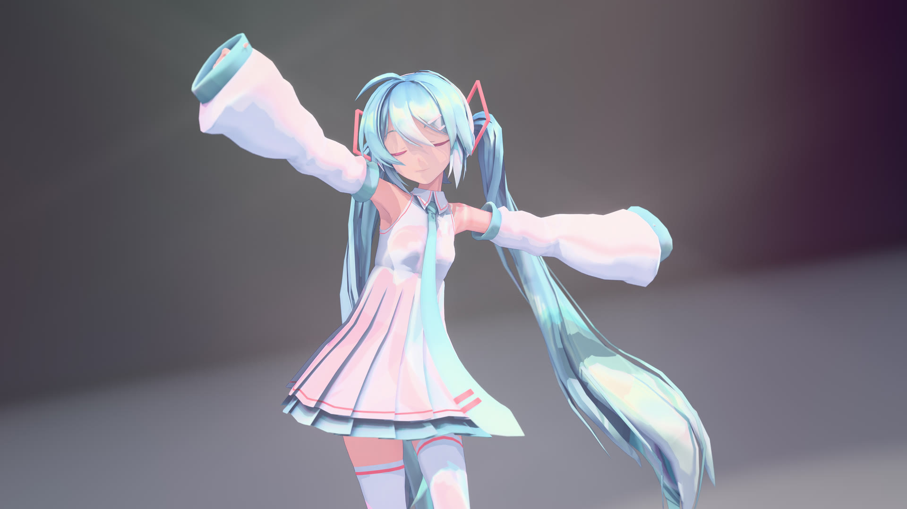
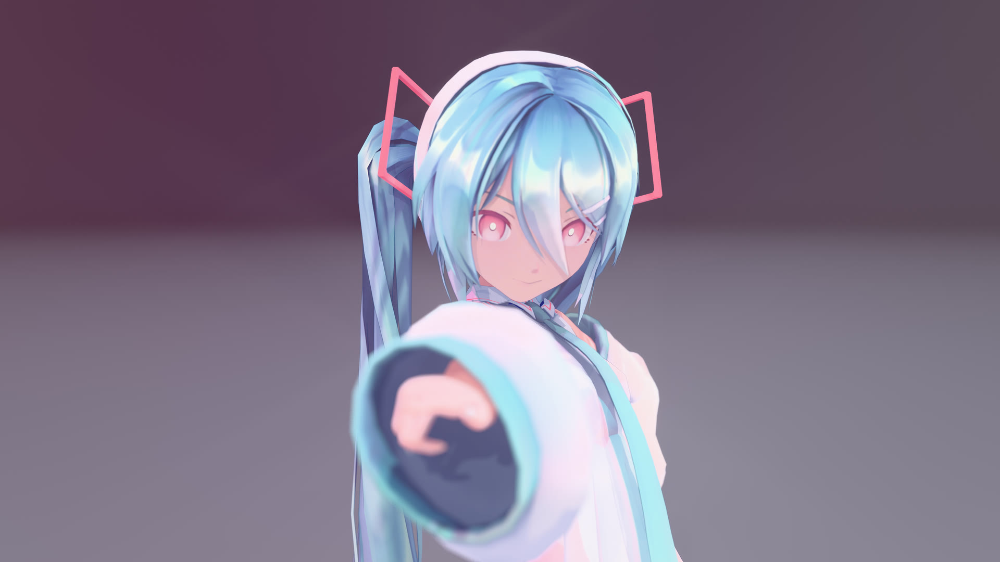
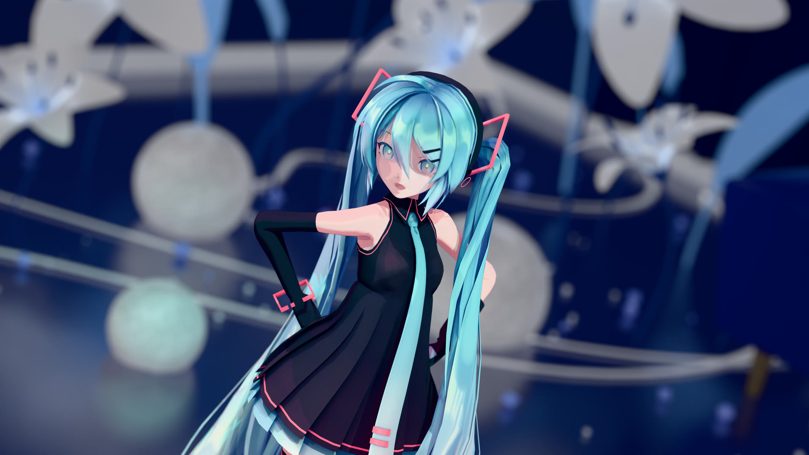
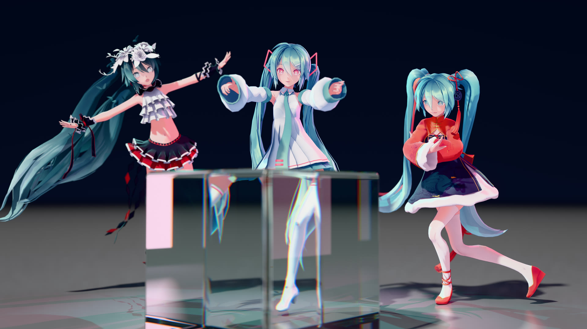
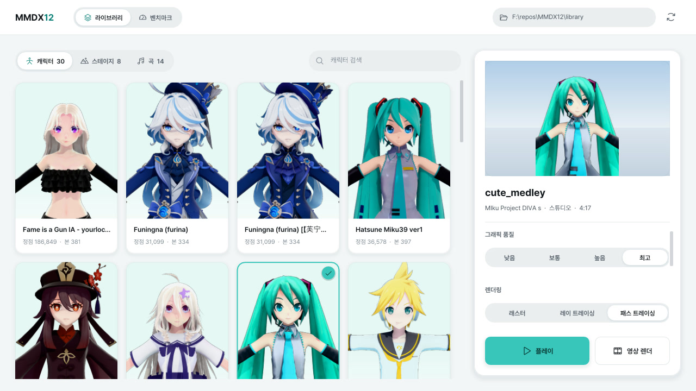

<div align="center">
  <h1>MMDX12</h1>
  <p><a href="README.md">English</a> · <b>한국어</b> · <a href="README.ja.md">日本語</a> · <a href="README.zh.md">简体中文</a></p>
  <p>갖고 있는 MMD 모델이랑 춤 파일 넣고 재생만 누르면 레이 트레이싱 조명으로 바로 볼 수 있어요.<br>더 예쁘게 뽑고 싶으면 앱 안에서 4K 사진이나 뮤직비디오 한 편까지 렌더링됩니다.</p>
  <p>
    
    
    <a href="LICENSE"></a>
    <a href="https://youtu.be/7S7D670HbIM"></a>
    <a href="#후원"></a>
  </p>
  <a href="https://youtu.be/7S7D670HbIM">
    
  </a>
  <br>
  ▶ YouTube: <a href="https://youtu.be/7S7D670HbIM">전체 소개 영상</a>
  <p>
    <a href="#갤러리">갤러리</a> ·
    <a href="#할-수-있는-것">할 수 있는 것</a> ·
    <a href="#시작하기">시작하기</a> ·
    <a href="#벤치마크">벤치마크</a>
  </p>
</div>

## 갤러리

내장 렌더러로 뽑은 그대로예요. 보정 안 했습니다.

<table>
  <tr>
    <td>
      
      <br><i>부드러운 스튜디오 조명</i>
    </td>
    <td>
      
      <br><i>앞쪽이 흐릿하게 날아간 클로즈업</i>
    </td>
  </tr>
  <tr>
    <td>
      
      <br><i>밤 무대</i>
    </td>
    <td>
      
      <br><i>벤치마크 장면: 유리 큐브를 통과하며 꺾이는 빛</i>
    </td>
  </tr>
</table>

## 할 수 있는 것

- **파일은 그냥 던져 넣으면 끝.** 폴더 정리 안 해도 캐릭터, 무대, 춤을 알아서 구분해요.
- **실시간 재생.** 익숙한 MMD 툰 느낌 그대로 보거나, 레이 트레이싱·패스 트레이싱을 켜서 사실적인 빛과 반사로 볼 수 있어요.
- **머리카락이랑 치마가 흔들려요.** 모델에 들어 있는 물리 설정을 그대로 씁니다.
- **DLSS, FSR, XeSS** 지원. 프레임이 아쉬우면 켜 보세요.
- **사진 모드**: P 키 한 번이면 4K 사진.
- **영상 모드**: 노래 한 곡을 음악까지 넣어서 MP4로, 최대 4K. 시작하기 전에 얼마나 걸릴지 미리 알려 줘요.
- **벤치마크**와 온라인 순위표. 그냥 재미로요.


<br><sub>라이브러리 화면</sub>

## 에셋은 직접 준비해 주세요

> [!IMPORTANT]
> MMDX12에는 모델, 춤, 무대, 음악이 하나도 들어 있지 않아요. MMD 에셋은 만든 분들의 것이라 같이 배포할 수가 없거든요. 갖고 계신 걸 쓰시되, 에셋마다 정해진 규약은 꼭 지켜 주세요 (상업적 이용 금지나 영상 올릴 때 크레딧 표기 같은 것들요). 여기 나온 이미지와 영상은 제 개인 라이브러리로 만들었습니다.

`MMDX12.exe` 옆의 `library` 폴더에 넣거나, 앱에서 원하는 폴더를 고르면 돼요. 곡 폴더에는 춤 모션(`.vmd`)과 음악 파일만 있으면 되고, 카메라 모션이 있으면 알아서 같이 씁니다.

## 시작하기

1. [Releases](https://github.com/digital8150/MMDX12/releases/latest)에서 `MMDX12-<버전>-win64.zip`을 받아 아무 데나 압축을 풉니다.
2. `library` 폴더에 MMD 파일을 넣습니다.
3. `MMDX12.exe` 실행. 서명 안 된 실행 파일이라 처음에 SmartScreen 경고가 뜰 수 있는데, "추가 정보" → "실행"을 누르면 됩니다.

**필요한 것:** Windows 10/11, DirectX 12 그래픽카드. 레이 트레이싱, 패스 트레이싱, 고품질 렌더러는 레이 트레이싱 되는 그래픽카드(NVIDIA RTX, AMD RX 6000 이상, Intel Arc 등)가 필요하고, DLSS는 NVIDIA RTX 전용이에요.

### 조작법

| 키 | 기능 |
|---|---|
| Space | 재생 / 일시정지 |
| ← / → | 5초 앞뒤로 |
| C | 춤에 들어 있는 카메라 ↔ 자유 카메라 |
| L | 조명 바꾸기 |
| P | 4K 사진 찍기 (`사진\MMDX12`에 저장) |
| F1 | UI 숨기기 |
| 마우스 드래그 / 우클릭 드래그 / 휠 | 회전 / 이동 / 확대·축소 |
| Esc | 뒤로 |

영상은 **플레이** 옆의 **영상 렌더** 버튼으로 만들고, `동영상\MMDX12`에 저장돼요. 최고 품질로 돌리면 시간이 꽤 걸립니다. 노트북 RTX 3060 기준 4K 한 프레임에 10초쯤이라, 노래 한 곡이면 하룻밤은 넘게 걸려요. 도중에 Esc로 멈춰도 거기까지 렌더된 건 남아요.

## 벤치마크

1080p, 4K 실시간 테스트와 4K 사진 한 장을 그리는 데 걸리는 시간을 재는 시네벤치 같은 테스트가 있어요. 결과 화면에서 온라인 순위표에 올릴 수 있습니다.

에셋을 같이 줄 수가 없다 보니 벤치마크 장면도 각자 라이브러리에서 만들어요 (가장 무거운 모델과 적당한 곡을 골라서). 그래서 라이브러리가 비슷한 사람끼리만 제대로 비교가 되니까, 순위표는 재미로만 봐 주세요.

## 소스에서 빌드하기

<details>
<summary>개발자용</summary>

Visual Studio 2026 (v18)과 Windows SDK, 그리고 CMake + Ninja(`pip install cmake ninja`)가 필요해요.

```text
build.cmd
```

결과물은 `build\bin\MMDX12.exe`예요. DLSS / FSR / XeSS 라이브러리는 따로 받아야 하고, 없으면 업스케일러만 꺼집니다.

```powershell
powershell -ExecutionPolicy Bypass -File tools/fetch_sdks.ps1
```

</details>

## 서드파티

| 의존성 | 라이선스 |
|---|---|
| [Dear ImGui](https://github.com/ocornut/imgui) | MIT |
| [stb](https://github.com/nothings/stb) | MIT / 퍼블릭 도메인 |
| [miniaudio](https://github.com/mackron/miniaudio) | MIT-0 / 퍼블릭 도메인 |
| [DirectX-Headers](https://github.com/microsoft/DirectX-Headers) | MIT |
| [nlohmann/json](https://github.com/nlohmann/json) | MIT |
| [Bullet Physics 3.25 subset](https://github.com/bulletphysics/bullet3) | zlib |
| [NVIDIA DLSS SDK](https://github.com/NVIDIA/DLSS) | NVIDIA RTX SDK license |
| [AMD FidelityFX SDK](https://github.com/GPUOpen-LibrariesAndSDKs/FidelityFX-SDK) | MIT |
| [Intel XeSS SDK](https://github.com/intel/xess) | Intel Simplified Software License |
| [Pretendard](https://github.com/orioncactus/pretendard) | SIL OFL 1.1 |
| [Phosphor Icons](https://github.com/phosphor-icons/core) | MIT |

*"MikuMikuDance"는 樋口優(Yu Higuchi) 님이 만들었고, 하츠네 미쿠는 Crypton Future Media의 캐릭터입니다. MMDX12는 비공식 팬 프로젝트이고 두 곳과 아무 관련이 없어요.*

## 후원

MMDX12가 마음에 드셨다면 비트코인으로 커피 한 잔 사 주세요:

<p>
  <a href="https://pay.digitalism.site/api/v1/invoices?storeId=63rqo9gJMgSoEn8N59SfUmBLrU6KFeLrXVAxtJQh6fgT&price=5000&currency=KRW"></a>
  <a href="https://pay.digitalism.site/api/v1/invoices?storeId=63rqo9gJMgSoEn8N59SfUmBLrU6KFeLrXVAxtJQh6fgT&price=10000&currency=KRW"></a>
  <a href="https://pay.digitalism.site/api/v1/invoices?storeId=63rqo9gJMgSoEn8N59SfUmBLrU6KFeLrXVAxtJQh6fgT&price=30000&currency=KRW"></a>
</p>

## 라이선스

MMDX12 코드는 [MIT](LICENSE)예요. 서드파티 코드는 각자의 라이선스를 따르고, MMD 에셋은 해당 없습니다.

## 다음에 할 것

- 재질 모프, SDEF 스키닝, PMD 모델, VMD 조명 트랙.
- 라이브러리 로딩 더 빠르게.
