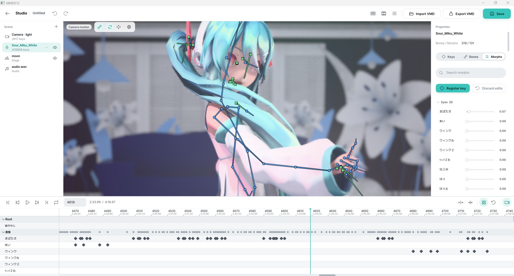

<div align="center">
  <h1>MMDX12</h1>
  <p><b>English</b> · <a href="README.ko.md">한국어</a> · <a href="README.ja.md">日本語</a> · <a href="README.zh.md">简体中文</a></p>
  <p>Drop in your MMD models and dances, hit play, and watch them with ray-traced lighting.<br>When you want something prettier, render a 4K still or a full music video right from the app.</p>
  <p>
    
    
    <a href="LICENSE"></a>
    <a href="https://youtu.be/QQFtn_meacA"></a>
    <a href="#support"></a>
  </p>
  <a href="https://youtu.be/QQFtn_meacA">
    
  </a>
  <br>
  ▶ YouTube: <a href="https://youtu.be/QQFtn_meacA">Full introduction</a>
  <p>
    <a href="#gallery">Gallery</a> ·
    <a href="#what-it-does">What it does</a> ·
    <a href="#getting-started">Getting started</a> ·
    <a href="#studio">Studio</a> ·
    <a href="#benchmark">Benchmark</a> ·
    <a href="#mcp-control">MCP Control</a>
  </p>
</div>

## Gallery

Straight out of the built-in renderer, no touch-ups.

<table>
  <tr>
    <td>
      
      <br><i>Soft studio lighting</i>
    </td>
    <td>
      
      <br><i>Close-up with a blurry foreground</i>
    </td>
  </tr>
  <tr>
    <td>
      
      <br><i>Night stage</i>
    </td>
    <td>
      
      <br><i>The benchmark scene: light bending through a glass cube</i>
    </td>
  </tr>
</table>

## Videos

Full songs rendered with MMDX12's video mode, uploaded as-is.

<table>
  <tr>
    <td align="center" width="50%">
      <a href="https://youtu.be/tng53F--jEM"></a>
      <br><b>モニタリング (Best Friend Remix)</b>
      <br><sub>Path-traced 4K 60FPS</sub>
    </td>
    <td align="center" width="50%">
      <a href="https://youtu.be/WqZzpxBWhj4"></a>
      <br><b>Cute Medley: Idol Sounds</b>
      <br><sub>Path-traced QHD 60FPS</sub>
    </td>
  </tr>
  <tr>
    <td align="center" width="50%">
      <a href="https://youtu.be/6JerS9iSD50"></a>
      <br><b>World is Mine</b>
      <br><sub>Path-traced QHD 24FPS</sub>
    </td>
    <td align="center" width="50%">
      <a href="https://youtu.be/xYYAZFU4Yz8"></a>
      <br><b>Catch the Wave</b>
      <br><sub>Path-traced 4K 60FPS</sub>
    </td>
  </tr>
</table>

## What it does

- **PMX, VRM, glTF and FBX.** VRoid, Mixamo or Ready Player Me avatars dance to ordinary MMD motions, and glTF/FBX/OBJ scenes work as stages.
- **Organise your files your way.** `characters`, `stages` and `songs` folders are the sure way; anything else is sorted by content, and you can correct it in the app.
- **Real-time playback** with the classic MMD toon look, or switch on ray tracing and path tracing for realistic light and reflections.
- **Hair and skirts move** with the model's own physics setup.
- **Shader packs**: anyone can write a pack that changes how a character is shaded; browse, install and update them in the app's Shaders tab. The bundled `hoyo_toon` pack gives the official Genshin / Star Rail / ZZZ models their in-game flat faces, and the online gallery has `nimble_toon`, a soft cel look for the official Eternal Return models in raster, ray tracing, path tracing and offline GI ([gallery and docs](https://mmdx.codingbot.kr/en/docs/shader-packs/)). Packs can sample their own textures (ramps, face SDFs, LUTs; game textures you can't redistribute go in a per-pack texture folder you pick in the manager) and draw custom outlines.
- **DLSS, FSR and XeSS** if you want more frames.
- **Photo mode**: press P for a 4K picture.
- **Video mode**: render a whole song to MP4, with the music, up to 4K. The app tells you how long it will take before you start.
- **Studio**: edit dances yourself with an MMD-style keyframe editor, saving standard VMD/VPD files that MMD opens.
- **A benchmark** with an online leaderboard, just for fun.


<br><sub>The library screen. The app's UI is in Korean.</sub>

## Bring your own assets

> [!IMPORTANT]
> MMDX12 doesn't come with any models, dances, stages or music. MMD assets belong to their creators and can't be redistributed, so you use your own collection. Please follow each asset's rules (many don't allow commercial use, or ask for credit when you post a video). Everything shown here was made with my own local library.

Put everything in the `library` folder next to `MMDX12.exe` (or pick a folder inside the app). It comes with three folders:

| Folder | What goes in | Formats |
|---|---|---|
| `characters/` | one folder per model, with its textures | PMX, VRM, glTF/GLB, FBX |
| `stages/` | one folder per stage (all PMX files in it are drawn together) | PMX, glTF/GLB, FBX, OBJ |
| `songs/` | one folder per song: dance motion, camera motion, music | VMD, WAV/MP3/OGG/FLAC |

Other layouts work too: folder names like `models` or `motions` count, and without them MMDX12 guesses from the content (a humanoid skeleton is a character, a big static scene is a stage, several songs in one folder are told apart by length and file names). If it guesses wrong, right-click the card to use it as a character or a stage, or to hide it. Or put an `mmdx.json` in the folder:

```json
[
  {"type": "character", "model": "avatar.fbx", "name": "My avatar"},
  {"type": "song", "dance": "dance.vmd", "camera": "cam.vmd", "audio": "song.mp3"}
]
```

`type` is `character`, `stage`, `song` or `ignore`; without file names it applies to the whole folder. Models other than PMX need a humanoid skeleton (VRM, VRoid, Mixamo, Ready Player Me, Unity/Blender/UE rigs). They're converted to MMD bones when loaded, without hair or skirt physics.

## Getting started

> 📖 The **[user guide](https://mmdx.codingbot.kr/en/docs/)** walks through everything from install to the Studio with real app screenshots.

1. Download `MMDX12-<version>-win64.zip` from [Releases](https://github.com/digital8150/MMDX12/releases/latest) and unzip it anywhere.
2. Add your MMD files to the `library` folder.
3. Run `MMDX12.exe`. Windows may show a SmartScreen warning the first time because the exe isn't signed: click "More info", then "Run anyway".

**What you need:** Windows 10/11 and a DirectX 12 graphics card. Ray tracing, path tracing and the high-quality renderer need a ray-tracing capable GPU (e.g. NVIDIA RTX, AMD RX 6000+, Intel Arc). DLSS needs an NVIDIA RTX card.

### Controls

| Key | Action |
|---|---|
| Space | Play / pause |
| ← / → | Skip 5 seconds |
| C | Switch between the dance's camera and free camera |
| L | Change lighting |
| P | Take a 4K picture (saved to `Pictures\MMDX12`) |
| F1 | Hide the UI |
| Mouse drag / right drag / wheel | Rotate / move / zoom |
| Esc | Back |

Videos are made from the **영상 렌더** (Render video) button next to **플레이** (Play) and saved to `Videos\MMDX12`. The highest-quality mode takes a while: on a laptop RTX 3060 a 4K frame takes about 10 seconds, so a full song is an overnight-or-longer job. You can stop with Esc at any time and keep what's been rendered.

## Studio



On the library screen, click **New Studio project** with nothing selected to open an empty project, or click **Edit in Studio** with a character or song selected to start with the scene pre-filled. The `...` menu next to it opens existing or recent projects.

The scene list on the left manages the camera, characters, accessories, stages, and audio; the `+` button adds models (PMX, VRM, glTF, FBX) from the library or files. In the middle is the 3D viewport, on the right is the inspector (keys, bone, and morph tabs, plus camera, light, and self-shadow settings when the camera is selected), and at the bottom is the timeline, grouping bones by the model's display frames, along with a Bezier interpolation curve editor.

Click bones in the 3D viewport and pose them with rotation and translation gizmos (local or global axes). Moving IK bones drives the bone chain. Just like MMD, edits stay until you register them (`I`), and you can use morph sliders, mirror poses, or import and export VPD pose files. The timeline supports adding, moving, deleting, copying, and pasting keys, pasting curves only, curve presets, MMD-style frame insertion and deletion, frame range selection, loop playback with music, and toggling physics. You can also edit camera, light, and self-shadow tracks, use "Key the current view", and see the camera path while using the free camera.

Projects are saved as `.mmdxproj` files, and motions are saved alongside them as standard VMD files that MMD can open. Autosave provides recovery after crashes, audio supports a start offset, and accessories (props) can be attached to any bone of another model. You can render directly from the studio using the same video dialog as the library (raster, real-time ray tracing, real-time path tracing, offline GI), exporting the timeline range or the whole project through the motion camera with music to a video or high-quality still. MMD compatibility relies on standard files (VMD, VPD); PMM project files are not supported.

| Key | Action |
|---|---|
| Space | Play / pause |
| ← / → | Previous / next frame |
| Ctrl+← / → | Previous / next key |
| Home / End | Start / end |
| I | Register the pose (Ctrl+I: all bones) |
| Delete | Delete selected keys |
| Ctrl+C / X / V | Copy / cut / paste keys (Ctrl+Shift+V: interpolation curves only) |
| Ctrl+A | Select all keys |
| Ctrl+Z / Ctrl+Y | Undo / redo |
| E / W / L | Rotate tool / move tool / local ↔ global axes |
| Ctrl+S / Ctrl+Shift+S | Save / save as |
| Ctrl+O / Ctrl+N | Open / new project |
| ? / F1 | Shortcut list |
| Mouse in the 3D view | Left drag: orbit (or gizmo / bone pick) · right or middle drag: pan · wheel: zoom |
| Mouse in the timeline | Wheel: scroll · Ctrl+wheel: zoom · Shift+wheel: scroll sideways · Shift+drag on the ruler: frame range |

## Benchmark

There's a benchmark mode with real-time tests at 1080p and 4K, plus a Cinebench-style test that renders one 4K picture and times it. You can post your score to the online leaderboard from the result screen.

Since no assets ship with the app, the benchmark builds its scene from your own library (the heaviest models and a suitable song). That means scores only really compare between people with similar libraries, so treat the leaderboard as a toy.

## MCP Control

MMDX12 can be controlled interactively by AI assistants (Claude Desktop, Cursor, Antigravity) over the [Model Context Protocol](docs/mcp.md).
- Control playback, cameras, scene loading, and render settings.
- Stream in-memory GPU backbuffer screenshots directly to agents.
- Full Studio inspection, pose and light adjustments, and keyframe editing.
- Automated offline still and video rendering.

See [docs/mcp.md](docs/mcp.md) for configuration instructions and the complete 33-tool reference.

## Building from source

<details>
<summary>For developers</summary>

You'll need Visual Studio 2026 (v18) with the Windows SDK, and CMake + Ninja (`pip install cmake ninja`).

```text
build.cmd
```

The result is `build\bin\MMDX12.exe`. The DLSS / FSR / XeSS libraries are downloaded separately; without them the upscalers are simply turned off:

```powershell
powershell -ExecutionPolicy Bypass -File tools/fetch_sdks.ps1
```

</details>

## Third-party

| Dependency | License |
|---|---|
| [Dear ImGui](https://github.com/ocornut/imgui) | MIT |
| [stb](https://github.com/nothings/stb) | MIT / Public domain |
| [miniaudio](https://github.com/mackron/miniaudio) | MIT-0 / Public domain |
| [DirectX-Headers](https://github.com/microsoft/DirectX-Headers) | MIT |
| [nlohmann/json](https://github.com/nlohmann/json) | MIT |
| [cgltf](https://github.com/jkuhlmann/cgltf) | MIT |
| [ufbx](https://github.com/ufbx/ufbx) | MIT / Public domain |
| [Bullet Physics 3.25 subset](https://github.com/bulletphysics/bullet3) | zlib |
| [NVIDIA DLSS SDK](https://github.com/NVIDIA/DLSS) | NVIDIA RTX SDK license |
| [AMD FidelityFX SDK](https://github.com/GPUOpen-LibrariesAndSDKs/FidelityFX-SDK) | MIT |
| [Intel XeSS SDK](https://github.com/intel/xess) | Intel Simplified Software License |
| [Pretendard](https://github.com/orioncactus/pretendard) | SIL OFL 1.1 |
| [Phosphor Icons](https://github.com/phosphor-icons/core) | MIT |

*"MikuMikuDance" was made by Yu Higuchi (樋口優), and Hatsune Miku is a Crypton Future Media character. MMDX12 is an unofficial fan project and isn't affiliated with either.*

## Support

If you enjoy MMDX12, you can buy me a coffee with Bitcoin:

<p>
  <a href="https://pay.digitalism.site/api/v1/invoices?storeId=63rqo9gJMgSoEn8N59SfUmBLrU6KFeLrXVAxtJQh6fgT&price=5&currency=USD"></a>
  <a href="https://pay.digitalism.site/api/v1/invoices?storeId=63rqo9gJMgSoEn8N59SfUmBLrU6KFeLrXVAxtJQh6fgT&price=10&currency=USD"></a>
  <a href="https://pay.digitalism.site/api/v1/invoices?storeId=63rqo9gJMgSoEn8N59SfUmBLrU6KFeLrXVAxtJQh6fgT&price=25&currency=USD"></a>
</p>

## License

MMDX12's own code is [MIT](LICENSE). Third-party code keeps its own license, and MMD assets aren't covered.

## What's next

- Material morphs, SDEF skinning, PMD models, and the player's VMD light track.
- Faster library loading.
- Studio follow-ups: accessories (.x), PMM import.
