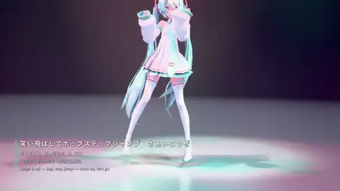
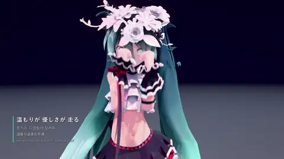
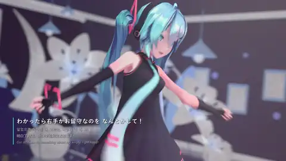
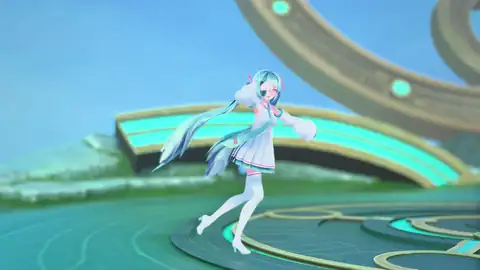

<div align="center">
  <h1>MMDX12</h1>
  <p><a href="README.md">English</a> · <a href="README.ko.md">한국어</a> · <a href="README.ja.md">日本語</a> · <b>简体中文</b></p>
  <p>放入你自己的 MMD 模型和舞蹈文件,点一下播放,就能用光线追踪的光照直接观看。<br>想要更好的画质时,还可以在软件里直接渲染 4K 照片,甚至整支音乐视频。</p>
  <p>
    
    
    <a href="LICENSE"></a>
    <a href="https://www.bilibili.com/video/BV1m8Hr6JEP3/?"></a>
    <a href="#支持"></a>
  </p>
  <a href="https://www.bilibili.com/video/BV1m8Hr6JEP3/?">
    
  </a>
  <br>
  ▶ <a href="https://www.bilibili.com/video/BV1m8Hr6JEP3/">Bilibili 完整介绍视频</a>
  <p>
    <a href="#画廊">画廊</a> ·
    <a href="#功能">功能</a> ·
    <a href="#开始使用">开始使用</a> ·
    <a href="#基准测试">基准测试</a>
  </p>
</div>

## 画廊

下面都是内置渲染器直接输出的原图,没有做任何后期修饰。

<table>
  <tr>
    <td>
      
      <br><i>柔和的影棚灯光</i>
    </td>
    <td>
      
      <br><i>前景大幅虚化的特写</i>
    </td>
  </tr>
  <tr>
    <td>
      
      <br><i>夜晚的舞台</i>
    </td>
    <td>
      
      <br><i>基准测试场景:光线穿过玻璃立方体时发生折射</i>
    </td>
  </tr>
</table>

## 视频

用 MMDX12 的视频模式整首歌渲染后,原样上传。

<table>
  <tr>
    <td align="center" width="50%">
      <a href="https://youtu.be/tng53F--jEM"></a>
      <br><b>モニタリング (Best Friend Remix)</b>
      <br><sub>路径追踪 4K 60FPS</sub>
    </td>
    <td align="center" width="50%">
      <a href="https://youtu.be/WqZzpxBWhj4"></a>
      <br><b>Cute Medley: Idol Sounds</b>
      <br><sub>路径追踪 QHD 60FPS</sub>
    </td>
  </tr>
  <tr>
    <td align="center" width="50%">
      <a href="https://youtu.be/6JerS9iSD50"></a>
      <br><b>World is Mine</b>
      <br><sub>路径追踪 QHD 24FPS</sub>
    </td>
    <td align="center" width="50%">
      <a href="https://youtu.be/xYYAZFU4Yz8"></a>
      <br><b>Catch the Wave</b>
      <br><sub>路径追踪 4K 60FPS</sub>
    </td>
  </tr>
</table>

## 功能

- **文件直接丢进去就行。** 不用整理文件夹,角色、舞台和舞蹈会自动识别。
- **实时播放。** 可以保持熟悉的 MMD 卡通风格,也可以打开光线追踪或路径追踪,看到真实的光影和反射。
- **头发和裙子会摆动。** 直接使用模型自带的物理设置。
- 支持 **DLSS、FSR、XeSS**。帧率不够时可以试试。
- **拍照模式**:按一下 P 键,输出 4K 照片。
- **视频模式**:整首歌连同音乐一起导出为 MP4,最高 4K。开始之前还会告诉你大概要花多久。
- **基准测试**和在线排行榜,纯属好玩。


<br><sub>素材库界面</sub>

## 素材请自行准备

> [!IMPORTANT]
> MMDX12 本身不含任何模型、舞蹈、舞台和音乐。MMD 素材归创作者所有,无法随软件一起分发。请使用你自己拥有的素材,并务必遵守各素材的使用规约(例如禁止商用、发布视频时需要标注署名等)。这里展示的图片和视频,都是用我个人的素材库制作的。

把素材放进 `MMDX12.exe` 旁边的 `library` 文件夹,或者在软件里选择任意文件夹即可。歌曲文件夹里只需要舞蹈动作(`.vmd`)和音乐文件;如果有镜头动作,会自动一并使用。

## 开始使用

1. 从 [Releases](https://github.com/digital8150/MMDX12/releases/latest) 下载 `MMDX12-<版本>-win64.zip`,解压到任意位置。
2. 把 MMD 文件放进 `library` 文件夹。
3. 运行 `MMDX12.exe`。由于是未签名的可执行文件,第一次运行时可能会弹出 SmartScreen 警告,点击"更多信息"→"仍要运行"即可。

**系统要求:** Windows 10/11,支持 DirectX 12 的显卡。光线追踪、路径追踪和高质量渲染器需要支持光线追踪的显卡(NVIDIA RTX、AMD RX 6000 及以上、Intel Arc 等),DLSS 仅限 NVIDIA RTX。

### 操作方式

| 按键 | 功能 |
|---|---|
| Space | 播放 / 暂停 |
| ← / → | 后退 / 前进 5 秒 |
| C | 舞蹈自带镜头 ↔ 自由镜头 |
| L | 切换灯光 |
| P | 拍摄 4K 照片(保存到 `图片\MMDX12`) |
| F1 | 隐藏界面 |
| 鼠标拖动 / 右键拖动 / 滚轮 | 旋转 / 平移 / 缩放 |
| Esc | 返回 |

视频通过 **Play** 旁边的 **Render video** 按钮制作,保存到 `视频\MMDX12`。用最高画质渲染会花不少时间:在笔记本 RTX 3060 上,4K 每帧大约 10 秒,所以一首歌要跑一整夜以上。中途按 Esc 停止,已渲染的部分也会保留。

## 基准测试

内置了类似 Cinebench 的测试,会测量 1080p 和 4K 实时渲染,以及渲染一张 4K 照片所需的时间。在结果界面可以把成绩提交到在线排行榜。

由于无法附带素材,基准测试的场景也是由每个人自己的素材库生成的(自动选取最重的模型和长度合适的歌曲)。所以只有素材库相近的人之间才能正确比较,排行榜就当娱乐看看吧。

## 从源码构建

<details>
<summary>开发者向</summary>

需要 Visual Studio 2026 (v18)、Windows SDK,以及 CMake + Ninja(`pip install cmake ninja`)。

```text
build.cmd
```

产物是 `build\bin\MMDX12.exe`。DLSS / FSR / XeSS 的库需要另行下载,缺少时只会禁用对应的超分功能。

```powershell
powershell -ExecutionPolicy Bypass -File tools/fetch_sdks.ps1
```

</details>

## 第三方组件

| 依赖 | 许可证 |
|---|---|
| [Dear ImGui](https://github.com/ocornut/imgui) | MIT |
| [stb](https://github.com/nothings/stb) | MIT / 公有领域 |
| [miniaudio](https://github.com/mackron/miniaudio) | MIT-0 / 公有领域 |
| [DirectX-Headers](https://github.com/microsoft/DirectX-Headers) | MIT |
| [nlohmann/json](https://github.com/nlohmann/json) | MIT |
| [Bullet Physics 3.25 subset](https://github.com/bulletphysics/bullet3) | zlib |
| [NVIDIA DLSS SDK](https://github.com/NVIDIA/DLSS) | NVIDIA RTX SDK license |
| [AMD FidelityFX SDK](https://github.com/GPUOpen-LibrariesAndSDKs/FidelityFX-SDK) | MIT |
| [Intel XeSS SDK](https://github.com/intel/xess) | Intel Simplified Software License |
| [Pretendard](https://github.com/orioncactus/pretendard) | SIL OFL 1.1 |
| [Phosphor Icons](https://github.com/phosphor-icons/core) | MIT |

*"MikuMikuDance"是樋口优先生的作品,初音未来是 Crypton Future Media 的角色。MMDX12 是非官方的粉丝项目,与两者均无关系。*

## 支持

如果你喜欢 MMDX12,欢迎用比特币请我喝杯咖啡:

<p>
  <a href="https://pay.digitalism.site/api/v1/invoices?storeId=63rqo9gJMgSoEn8N59SfUmBLrU6KFeLrXVAxtJQh6fgT&price=5000&currency=KRW"></a>
  <a href="https://pay.digitalism.site/api/v1/invoices?storeId=63rqo9gJMgSoEn8N59SfUmBLrU6KFeLrXVAxtJQh6fgT&price=10000&currency=KRW"></a>
  <a href="https://pay.digitalism.site/api/v1/invoices?storeId=63rqo9gJMgSoEn8N59SfUmBLrU6KFeLrXVAxtJQh6fgT&price=30000&currency=KRW"></a>
</p>

## 许可证

MMDX12 的代码采用 [MIT](LICENSE) 许可证。第三方代码遵循各自的许可证,MMD 素材不适用。

## 后续计划

- 材质变形、SDEF 蒙皮、PMD 模型、VMD 灯光轨道。
- 更快的素材库加载。
