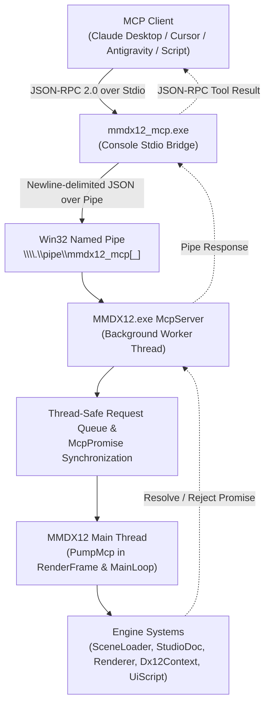

# Model Context Protocol (MCP) in MMDX12

MMDX12 supports interactive AI agent and tool automation via the [Model Context Protocol](https://modelcontextprotocol.io/) (protocol specification `2025-06-18`).

Agents running in Claude Desktop, Cursor, Antigravity, or custom automation scripts can inspect the active scene, query performance metrics, capture in-memory backbuffer screenshots, load songs and stages, edit poses and keyframes in Studio, trigger offline 4K / video renders, and simulate UI inputs.

---

## 1. Architecture



### Components
1. **Bridge (`mmdx12_mcp.exe`)**:
   - Lightweight console application that translates stdio JSON-RPC 2.0 protocol from the MCP host into Win32 named pipe transactions.
   - Manages connection lifecycle (`list_instances`, `connect`, `launch_app`).
   - Binary mode on stdin/stdout to prevent CRLF line ending corruption.
2. **Server (`MMDX12.exe` internal `McpServer`)**:
   - Listens on `\\.\pipe\mmdx12_mcp` (or `\\.\pipe\mmdx12_mcp_<pid>` if an instance is already listening).
   - Secured with an owner-only Win32 discretionary access control list (`D:(A;;GA;;;OW)`).
   - Overlapped asynchronous I/O with cancellation on app shutdown.
3. **Main Thread Pump (`App::PumpMcp`)**:
   - Drains requests synchronously during `RenderFrame()`, before UI and scene updates.
   - In minimized state, drained during `MainLoop()` to maintain responsiveness without burning GPU cycles.
   - Non-blocking multi-frame commands (`wait_frames`, `load_scene`, `ui_input`) suspend until target conditions are met.

---

## 2. Configuration & Setup

### Claude Code
```powershell
claude mcp add mmdx12 -- C:\path\to\MMDX12\mmdx12_mcp.exe --launch
```

### Claude Desktop
Add to your `%APPDATA%\Claude\claude_desktop_config.json`:

```json
{
  "mcpServers": {
    "mmdx12": {
      "command": "C:\\path\\to\\MMDX12\\bin\\mmdx12_mcp.exe",
      "args": ["--launch"]
    }
  }
}
```

### Cursor / Antigravity
Add to your project or user MCP settings:
```json
{
  "mcpServers": {
    "mmdx12": {
      "command": "C:/path/to/MMDX12/bin/mmdx12_mcp.exe",
      "args": ["--launch"]
    }
  }
}
```

---

## 3. Command Line Arguments

### `mmdx12_mcp.exe`
- `--pipe <name>`: Explicit pipe path or name (e.g., `mmdx12_mcp` or `\\.\pipe\mmdx12_mcp_1234`). Default: auto-connect to `\\.\pipe\mmdx12_mcp` or single running instance.
- `--pid <pid>`: Target specific process ID (`\\.\pipe\mmdx12_mcp_<pid>`).
- `--launch`: If no running MMDX12 instance is found, automatically spawns `MMDX12.exe --mcp` from the same folder and waits up to 60 s for its pipe to answer (the pipe opens before the library scan; `get_state` reports `scanning` until it is done).
- `--timeout <ms>`: Minimum per-request timeout in milliseconds (default: 30000). Loads wait up to 180 s, `wait_frames` / `ui_input` up to 120 s; an answer that arrives after a timeout is discarded.

### `MMDX12.exe`
- `--mcp`: Force enables MCP named pipe server for this run (ignores persisted `.ini` setting). Automated runs (`--frames`, `--ui-script`, `--screen`, benchmarks, offline renders) only open the pipe with `--mcp`.
- `--no-mcp`: Force disables MCP named pipe server for this run.

---

## 4. User Interface Integration

- **Detail Settings Tab**: Toggle `Tr("MCP 제어")` ("MCP Control") enables or disables the background server dynamically without needing a restart. Persisted in `mmdx12.ini` as `mcp=1` or `mcp=0`.
- **Connected Indicator**: When an MCP client or bridge is actively connected to the pipe:
  - **Lobby App Bar**: An illuminated pill badge with CPU icon and `MCP` label appears next to the library folder button.
  - **Studio Top Bar**: An illuminated pill badge appears next to the Help button.
  - **Hover Tooltip**: Displays the active pipe name (e.g., `MCP 연결됨: \\.\pipe\mmdx12_mcp`).

---

## 5. Tool Catalog (33 Tools)

### Bridge & Connection Management
1. `list_instances`: Enumerates active MMDX12 named pipes on `\\.\pipe\mmdx12_mcp*`.
2. `connect`: Connects or switches to a target pipe name or process ID.
3. `launch_app`: Spawns `MMDX12.exe --mcp` and waits for connection.

### Application State & Diagnostics
4. `get_state`: Inspects current screen (`select`, `play`, `studio`, etc.), playback status, current model/stage/song names, FPS, GPU render time in milliseconds, render path, upscaler, and window dimensions.
5. `get_recent_logs`: Returns the last $N$ lines from the application log.
6. `list_library`: Lists available characters, stages, and songs with filtering (`kind`: `all|character|stage|song`, optional search `query`).

### Screen Control & Capture
7. `screenshot`: Reads back the Direct3D 12 backbuffer into CPU memory, optionally downscaling to `max_width`, compresses to PNG via in-memory `stb_image_write`, and returns an MCP image block plus a short text block (size, screen). Default `max_width` is 1280.
8. `wait_frames`: Advances the simulation by $N$ frames before completing.
9. `set_screen`: Changes the active screen (`select`, `studio` = a new empty project, `shaders`, `bench`).

### Playback & Scene Loading
10. `load_scene`: Loads a character, stage, and song by name or substring into Play mode (returns when loaded). The lobby selection follows.
11. `open_studio`: Launches Studio with an empty project, a preloaded character/stage/song, or a `project` file.
12. `play`: Starts or resumes playback.
13. `pause`: Pauses playback.
14. `seek`: Jumps playback or the timeline cursor to `seconds` (clamped; the result gives the actual time).

### Graphics & Render Settings
15. `get_render_settings`: Queries active graphics preset, render path (`raster`, `rt`, `pt`), upscaler (`none`, `dlss`, `fsr`, `xess`), post-processing toggles (DoF, volumetric, bloom, LUT).
16. `set_render_settings`: Updates render path, upscaler, quality preset, lighting preset, DoF / volumetric / FFT bloom, the loaded character's shader pack, or `effects` (the whole effect stack: comma-separated effect pack ids, `none` clears it). Every value is checked first: an invalid one fails the call and changes nothing. Saved to the settings like the lobby's controls; the answer is the settings now in effect.

### Studio Control & Inspection
17. `studio_get_state`: Full dump of Studio document state, playhead position, selection, camera mode, dirty flag, undo/redo stack, and list of models with keyframe counts.
18. `studio_command`: Executes any `--ui-script` command (`studiobone`, `studiogizmo`, `studiolight`, `studiostate`, ...). `studionew` / `studioopen` / `studiosave` go through `open_studio` / `studio_open` / `studio_save` (unsaved-changes guard, waits for the load).
19. `studio_save`: Saves the active project to `file` (required).
20. `studio_open`: Opens a `.mmdxproj` project file.
21. `studio_add_model`: Adds a model by `file` path or `library` name (`kind`: `character`, `stage`, `prop`); answers once the model is loaded (or with the load error).
22. `studio_select`: Selects a model by index (-1 for camera).
23. `studio_set_camera`: Without `key`: sets the free view (the viewport stops looking through the motion camera). With `key: true`: writes the motion camera key at the playhead (inserted first if missing) and views through it.
24. `studio_set_bone`: Edits a bone of the selected character like the inspector's bone fields (VMD-local `translate` / `rotate_deg`; an omitted channel keeps the motion's value), one undo step; `key: true` registers it (auto-key does that by itself).
25. `studio_key`: Keys the playhead: `selected` (the selected rows / bones), `all` (every bone of the selected character), `camera`, `lights`. Answers `changed` (whether an undo step was added).
26. `undo`: Performs an undo operation.
27. `redo`: Performs a redo operation.

### Offline Video & Still Rendering
28. `render_still`: Starts an offline GI still of the current frame (play mode or studio) to `output` (optional); returns once started, poll `render_status`. The app keeps running afterwards.
29. `render_video`: Starts a video render with optional resolution, renderer, FPS, bitrate, spp and `start`/`end` seconds; the run's offline overrides go back when it ends.
30. `render_status`: Queries current render progress (frames rendered, percentage, ETA).
31. `render_cancel`: Aborts an ongoing offline render.

Navigation tools (`set_screen`, `load_scene`, `open_studio`, `studio_open`) refuse to leave a studio project with unsaved
changes unless `discard_unsaved: true`, and refuse while the app is loading, rendering or benchmarking. A failed load stays on its error screen (`get_state` shows `load_error`); any navigation tool leaves it.
While the window is minimized, read-only queries answer as they are; every other tool restores the window first (it needs rendered frames).

### Input Simulation & Lifetime
32. `ui_input`: Injects virtual UI mouse and keyboard events (`move`, `click`, `dblclick`, `down`, `up`, `wheel`, `key`, `text`, `mod`) the same commands as `--ui-script`. Events run one per frame unless they give `frame` (offset from now); clicks add their own press / release. Real mouse / keyboard input is ignored only while injected steps are pending.
33. `quit_app`: Requests clean application shutdown.

---

## 6. Smoke Testing

Run the included standalone Python test script (requires only Python standard library):

```powershell
# Validate protocol handshake, capabilities, and all 33 tool schemas without running MMDX12:
python tools/mcp_smoke.py --handshake-only

# Run full end-to-end scenario (launches app, inspects state, loads scene, captures PNG, tests studio, exits cleanly):
python tools/mcp_smoke.py --scenario
```
